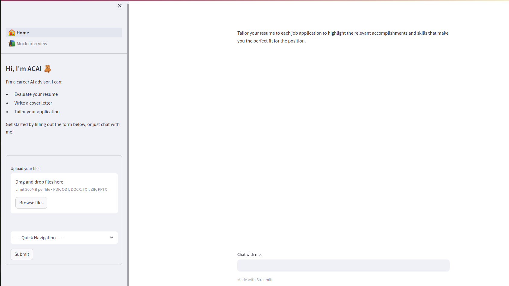
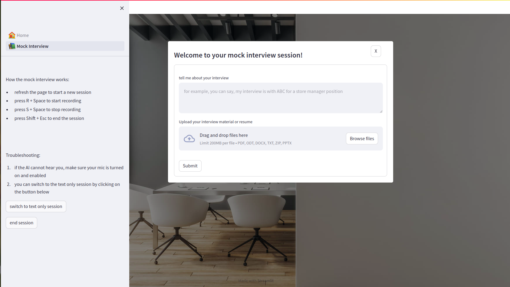

# Creating a functional site using AutoGPT

"AI is the new electricity" - Andrew NG

### setting up AutoGPT
- If you followed the [setup page][https://docs.agpt.co/setup/] and ran into problems, I got a few troubleshooting tips
  - When you download their latest release [https://github.com/Significant-Gravitas/Auto-GPT], note the python version required. Currently it's 3.10 or later. If your virtual environment has a python version that does not meet the requirement, you will run into multiple problems. So make sure to specify the right python version when you create your environment!
  - If you enabled Redis as the backend, make sure you have Redisearch too. Use command "docker run -p 6379:6379 redislabs/redisearch:latest" to start Redisearch before running AutoGPT. If you run into Redis related errors, I suggest you kill all instances of Redis running on default port 6379 then restart Redisearch. If you're not able to kill the server, stop it using "/etc/init.d/redis-server stop"
  - If you enabled Redis and you're asked to set up an authentication password for the Redis server, follow this [set up link][https://stackink.com/how-to-set-password-for-redis-server/]
  - The very first time before activating your virtual environment, I suggest you run "pip install -r requirements.txt" first. Although AutoGPT should automatically run requirements.txt the very first time when it sees you don't have required packages installed, sometimes it doesn't, which means you'll have to manually pip install every package (not suggested!)

### knowing AutoGPT's limitations
- It is an AI assistance that needs human assistance. This could be the start of human-AI collaboration, which could be where future is going with AI. Imagine we each have a personal AI assistant that helps us run our lives.
 

### what I want it to do for me
#### create a functional webpage that uses OpenAI's LLM models for content creation (this part I have mostly given up. I ended up coding everything without its help )
#### extra: maintain the site and monitor the budget (still hopeful this can be achieved)


# What this project will become

### An AI Powered job hosting platform with AI-powered features such as a cover letter generator and a chatbot for helping people improve their resumes. The ultimate goal is creating a powerful AI powered job search engine.

[Refer to document for more detail](./designs/concepts.odt)

All features will be connected to a chatbot, so there will be only two main interfaces. Page 1 is the entry point and page 2 is the chatbot.

page 1

page 2

everything is still a work in progress


#### Cover Letter Generator

Where user uploads his/her resume along with the job position and company they’re applying to and they’ll be given a personalized cover letter. This uses some basic LangChain functionalities. 


#### Resume Chat Bot

A chat-bot that has been trained to expertly assess resume will provide feedback on how a user’s resume can be improved; some obvious flaws such as missing fields, misspellings, grammar can already be easily spotted by any pretrained llm. HOWEVER, some things that need more human expertise will need RLHF (not feasible, will try vector store embedding instead)
    


#### Job Search Engine

A search engine powered by AI for matching people with job they want (welcome any collaboration on this)


#### How to Run

- Cover letter generator w/ frontend: run these 2 commands in 2 separate terminals
````
 python3 -m celery -A backend_flask  worker -l INFO 

 python3 backend_flask.py

````
- Resume advisor chatbot w/ frontend
````
 streamlit run backend_streamlit.py
````

- Individual feature testing w/o frontend:

```
cover letter generator: python3 generate_cover_letter.py

resume advisor: python3 upgrade_resume.py
```


